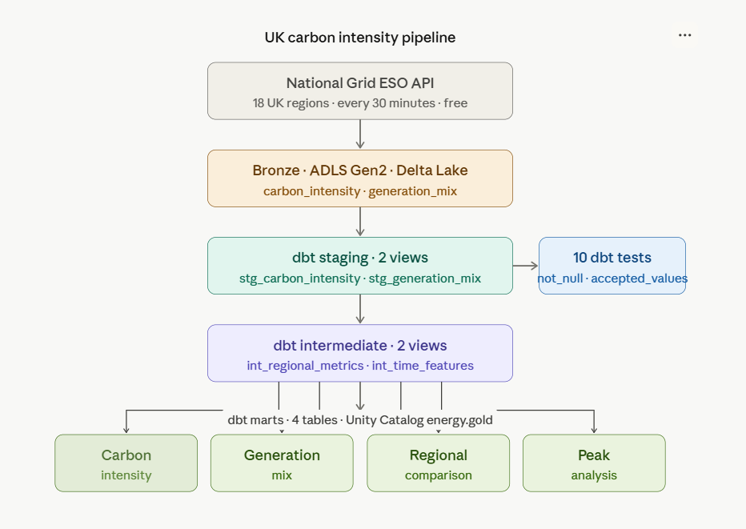
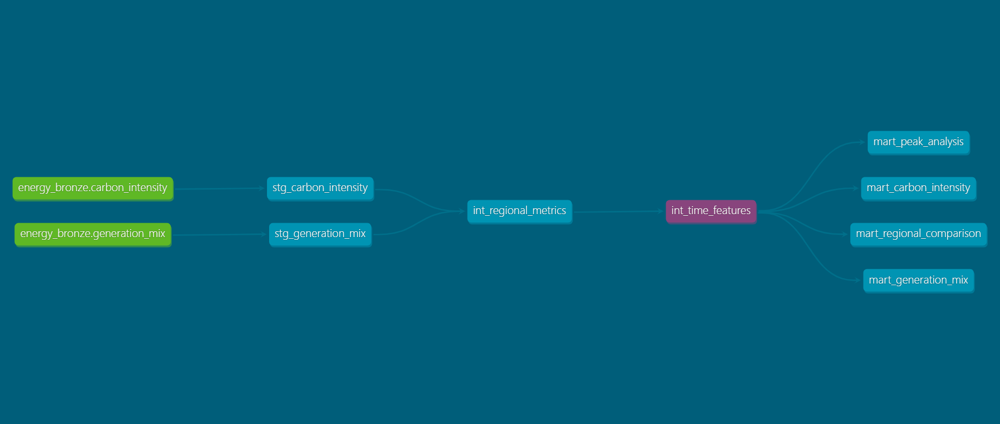

# UK Carbon Intensity Pipeline

The UK is legally committed to net zero carbon emissions by 2050.
Energy companies, grid operators, and sustainability teams need to understand:

- Which UK regions are most carbon intensive right now?
- What percentage of electricity comes from renewables vs fossil fuels?
- How does carbon intensity vary by time of day and region?
- Are regions trending cleaner over time?

The National Grid ESO publishes this data freely every 30 minutes
for 18 UK regions. This pipeline ingests it, models it with dbt,
and serves it to Power BI.

---

## What is dbt and why does it matter

dbt (data build tool) is how modern data teams write transformations.

In projects I did on healthcare and crypto, transformation logic lived inside PySpark notebooks.
That works but it has problems — logic is buried in notebooks, there are
no automated tests, you cannot see how tables relate to each other,
and reusing logic is messy.

dbt solves all of that. You write SQL files. dbt compiles them,
runs them against your Databricks SQL Warehouse, tracks dependencies
between models, runs data quality tests automatically, and generates
lineage documentation showing exactly how data flows from source to mart.

This is how serious data engineering teams work.

---

## Architecture

The key difference from the healthcare and crypto project: dbt replaces PySpark
for all transformations. There is no Silver notebook, no Gold notebook.
dbt handles everything from staging to marts in version-controlled SQL files.

---

## The dataset

Source: National Grid ESO Carbon Intensity API
URL: https://api.carbonintensity.org.uk/regional
Cost: free, no API key required
Regions: 18 UK regions including granular DNO regions and aggregates
Refresh: every 30 minutes
Fields: carbon intensity forecast (gCO2/kWh), intensity category,
        generation mix by fuel type (wind, solar, nuclear, gas, coal,
        hydro, biomass, imports)

---

## Why two Bronze tables

The API returns nested JSON — one intensity value per region but
nine fuel type percentages per region. Storing this in one flat table
forces a bad choice: either repeat the intensity value nine times
(redundant) or create nine separate fuel columns (brittle).

The correct solution is normalisation — two tables with a shared key:

`bronze.carbon_intensity` — one row per region per time window
`bronze.generation_mix` — one row per region per fuel type per window

They join on `region_id` and `period_from`. This is a fundamental
database design principle that dbt's staging models then build on.

---

## The dbt model architecture

Eight models across three layers:

### Staging (views)
`stg_carbon_intensity` — cleans intensity data, parses timestamps,
classifies regions as granular or aggregate

`stg_generation_mix` — cleans generation data, classifies fuel types
into renewable, low carbon, fossil, and imports categories

### Intermediate (views)
`int_regional_metrics` — joins intensity and generation data,
pivots fuel types from rows to columns using conditional aggregation,
computes clean energy percentage

`int_time_features` — extracts hour, day, month from timestamps,
classifies time periods as morning peak, evening peak, daytime, overnight,
separates weekdays from weekends

### Marts (tables)
`mart_carbon_intensity` — full time-series for granular regions
with all generation metrics and time features

`mart_generation_mix` — latest generation mix snapshot per region,
ordered by carbon intensity

`mart_regional_comparison` — aggregated metrics per region showing
average, min, max intensity and renewable percentage, with cleanest
and dirtiest rank

`mart_peak_analysis` — average intensity by region, time period,
and day type showing how carbon intensity varies throughout the day

---

## Data quality tests

10 automated tests run every time dbt runs:

- region_id is never null
- carbon_intensity_gco2_kwh is never null
- intensity_category only contains valid values
- region_type is either granular or aggregate
- fuel_type only contains the nine known fuel types
- fuel_category only contains the four classification values
- generation_pct is never null

If any test fails, the pipeline stops before bad data reaches analysts.
This is data quality as code — not a manual check after the fact.

---

## Data lineage

dbt generates a full lineage graph automatically showing how data
flows from Bronze source tables through staging and intermediate models
to the four mart tables.

Every arrow represents a dependency tracked by dbt. If a source table
changes, dbt knows exactly which downstream models are affected.

---

## Key findings

Carbon intensity varies dramatically across UK regions at any moment.
During the collection window North Scotland ran at 0 gCO2/kWh on
100% wind while South England ran at 119 gCO2/kWh on a mix of gas
and imports — a 119x difference across the same country at the same time.

Scotland consistently produces the cleanest electricity in Great Britain
due to its significant wind and nuclear capacity. South England and
South West England consistently show the highest intensity due to
dependence on gas and interconnector imports.

The UK has effectively eliminated coal from its generation mix. Coal
showed 0% across every region in every batch — a remarkable achievement
that was not true five years ago.

---

## What I learned building this

dbt separates concerns cleanly. Bronze ingestion is Python.
Transformation is dbt SQL. Orchestration is Workflows. Each tool
does what it is best at. The result is a pipeline where every layer
is independently testable and replaceable.

Normalisation matters before you model. The decision to split the API
response into two Bronze tables made every downstream dbt model simpler.
One fact in one place is not just a theoretical principle — it is
practical engineering that saves debugging time.

Data quality tests are not optional. Writing tests for intensity_category
accepted values caught a potential issue before it reached analysts.
In production, an unexpected API value would fail the test, stop the
pipeline, and alert the team — rather than silently corrupting a dashboard.

SQL window functions are powerful. The conditional aggregation pivot
in int_regional_metrics — using SUM(CASE WHEN fuel_type = 'wind' THEN
percentage ELSE 0 END) — is a pattern that appears in almost every
real analytical pipeline. Understanding it deeply is worth the effort.

---

## Azure stack

| Service | Name | Purpose |
|---|---|---|
| ADLS Gen2 | theportfoliostorage | Delta Lake storage |
| Azure Databricks | de-portfolio-dbx | Bronze ingestion compute |
| Databricks SQL Warehouse | de-portfolio-warehouse | dbt execution engine |
| Azure Key Vault | deportfolio-kv | Secret management |
| Unity Catalog | energy catalog | Data governance |
| dbt-databricks | energy_pipeline project | Transformation layer |

---
